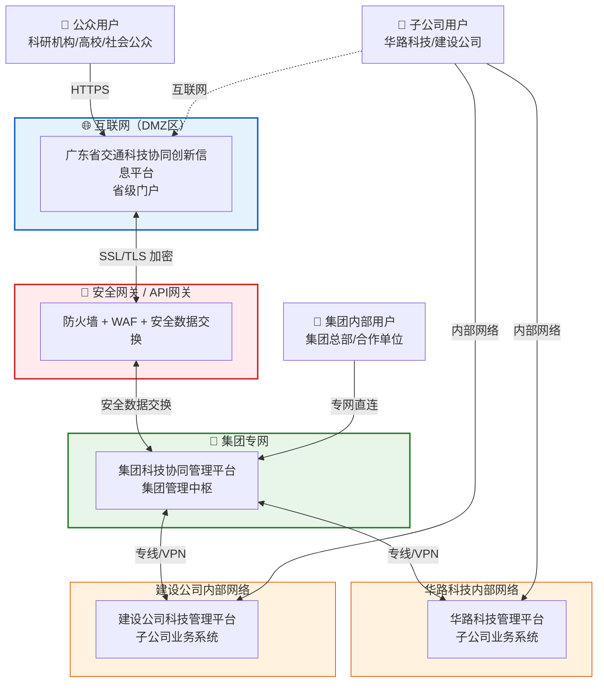
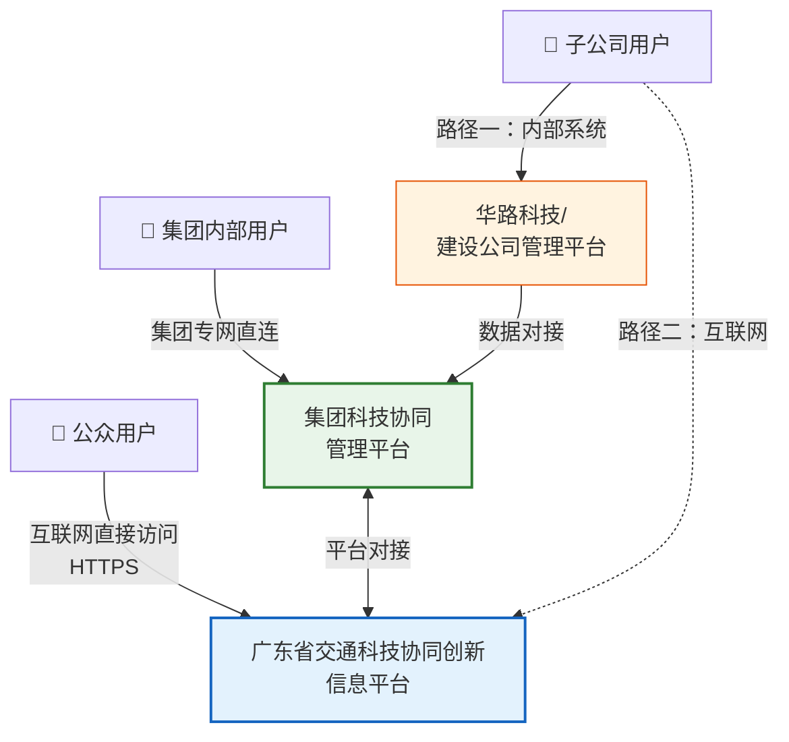

# 拓扑图 + 数据流图（Mermaid 源码）

## 方式一：应用网络拓扑图



## 方式二：数据流向图

```mermaid
graph LR
    subgraph 省级平台["广东省交通科技协同创新信息平台"]
        P["省级平台"]
    end

    subgraph 集团平台["集团科技协同管理平台"]
        G["集团平台"]
    end

    subgraph 华路["华路科技管理平台"]
        H["华路平台"]
    end

    subgraph 建设["建设公司科技管理平台"]
        J["建设平台"]
    end

    %% 下行数据流
    P ==>|行业政策<br/>科技资讯<br/>科研任务| G
    G ==>|标准化推送| H
    G ==>|标准化推送| J

    %% 上行数据流
    H -.->|科研数据上报| G
    J -.->|科研数据上报| G
    G -.->|汇总数据上报| P

    %% 跨系统协同
    P <..>|项目申报<br/>成果评审| H
    P <..>|项目申报<br/>成果评审| J

    %% 集团成果上报
    G -->|集团成果<br/>面向公众展示| P

    style 省级平台 fill:#E3F2FD,stroke:#1565C0,stroke-width:2px
    style 集团平台 fill:#E8F5E9,stroke:#2E7D32,stroke-width:2px
    style 华路 fill:#FFF3E0,stroke:#E65100,stroke-width:1px
    style 建设 fill:#FFF3E0,stroke:#E65100,stroke-width:1px
```

## 方式三：用户访问关系图



---

### 使用方法

1. **Draw.io（推荐）**：打开 https://app.diagrams.net → Arrange → Insert → Advanced → Mermaid，粘贴代码
2. **Mermaid Live Editor**：打开 https://mermaid.live 粘贴代码，可导出 PNG/SVG
3. **WPS**：新版 WPS 支持插入 Mermaid 图表（插入 → 智能图表），或截图粘贴
4. **导出为图片**后可直接插入 Word 文档的"拓扑图"章节
